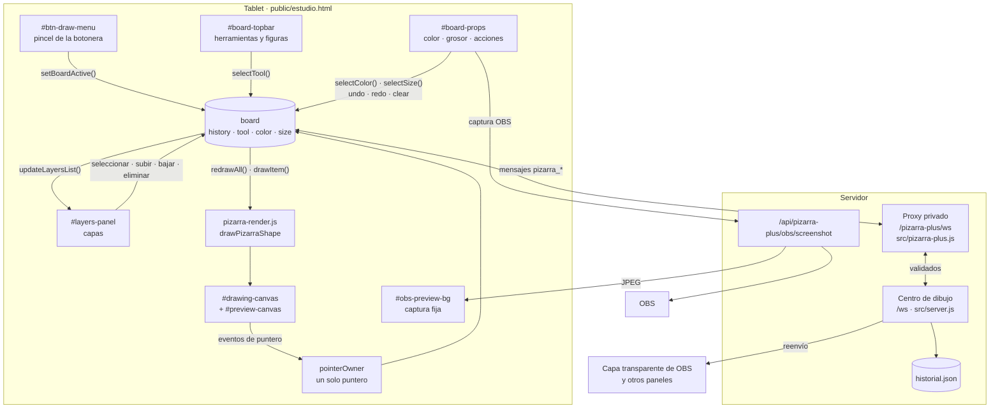
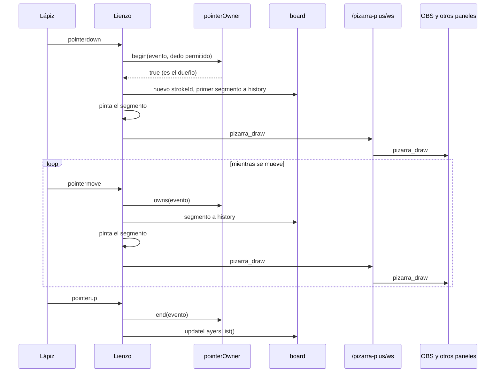
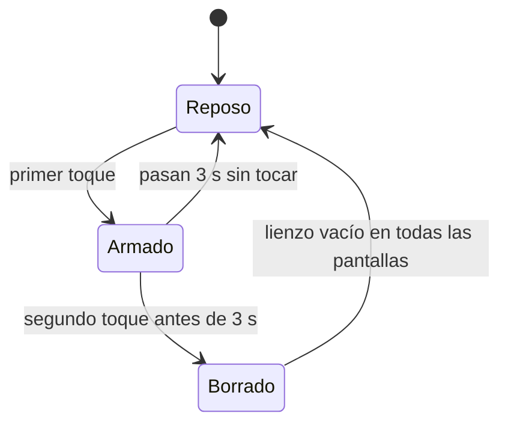
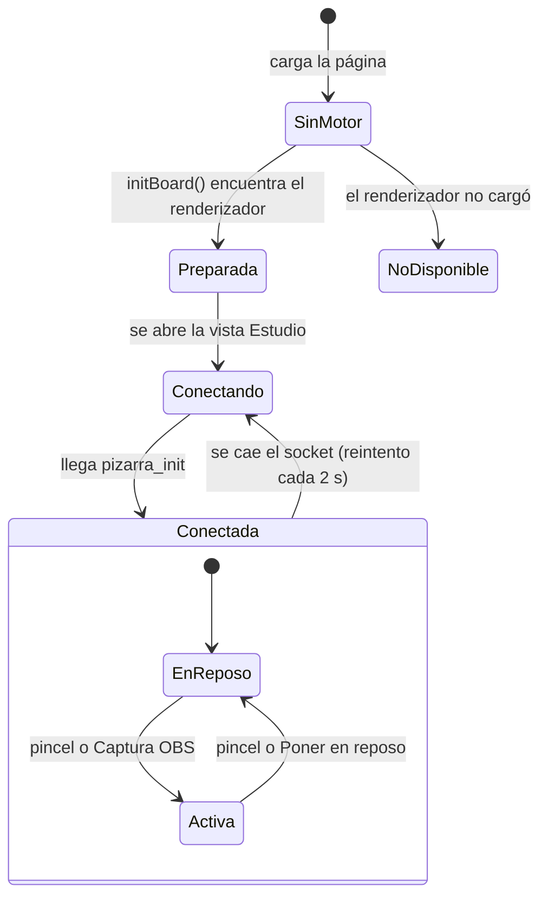
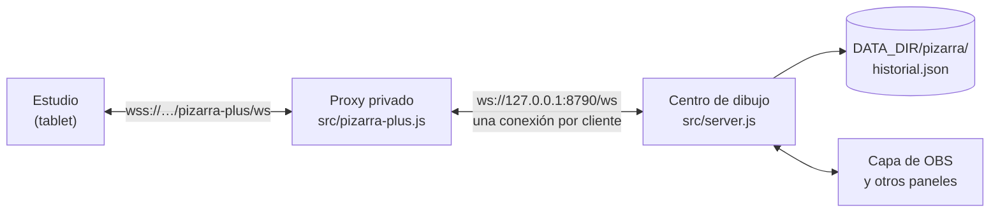

# Pizarra estilo Excalidraw del Estudio

Documento técnico de la pizarra de `public/estudio.html`: cómo está construida, por qué, cómo habla con el servidor y cómo usarla en un directo.

- **Estado**: implementada en el árbol de trabajo el 2026-10-10. Aún no probada en un directo real.
- **Código**: `public/estudio.html` (bloques "Pizarra estilo Excalidraw" en CSS y HTML, y `// ── Whiteboard` en JavaScript).
- **Tests**: `test/estudio.test.js`.
- **Tarea**: `control-erbolamm/tareas/haciendo/ge--apliarte-directo--redineno-paleta-colores-y-estilo-pizarra--javier--normal--2026-10-10.md`.

Si solo vas a usarla en directo, salta a la [guía de uso](#8-guía-de-uso-en-directo).

## Índice

1. [Qué es y qué cambió](#1-qué-es-y-qué-cambió)
2. [Diseño visual y experiencia de uso](#2-diseño-visual-y-experiencia-de-uso)
3. [Arquitectura](#3-arquitectura)
4. [Componentes](#4-componentes)
5. [Ciclo de vida](#5-ciclo-de-vida)
6. [Protocolo de red](#6-protocolo-de-red)
7. [Captura de OBS](#7-captura-de-obs)
8. [Guía de uso en directo](#8-guía-de-uso-en-directo)
9. [Limitaciones conocidas](#9-limitaciones-conocidas)
10. [Mantenimiento y tests](#10-mantenimiento-y-tests)

---

## 1. Qué es y qué cambió

La pizarra permite dibujar desde la tablet sobre lo que se está emitiendo. Lo dibujado aparece a la vez en la tablet, en cualquier otro panel abierto y en la capa transparente de OBS.

El rediseño no tocó el motor de dibujo (mensajes, servidor y renderizador son los mismos que en Pizarra Plus). Cambió **dónde están los controles**:

| Antes | Ahora |
|---|---|
| Hoja a pantalla completa (`#tools-sheet`) que tapaba el dibujo para elegir herramienta, color o grosor | Dos paneles flotantes sobre el lienzo, que queda siempre visible |
| Cinco botones de dibujo en la botonera inferior (pincel, captura OBS, deshacer, rehacer, limpiar) | Un solo botón: el pincel, que enciende y apaga la pizarra |
| 16 colores planos genéricos | 16 colores vivos elegidos para leerse en vídeo |
| Grosor solo con deslizador | Cuatro presets de un toque más el deslizador |
| Intervalo de captura de OBS en la hoja de escenas | Junto al botón de captura, en el panel de la pizarra |

## 2. Diseño visual y experiencia de uso

### 2.1 Reparto de la pantalla

Cada borde tiene un único papel, como en Excalidraw:

```text
┌──────────────────────────────────────────────────────────────────┐
│               ┌─ #board-topbar ───────────────────┐              │
│               │ 14 herramientas │ Relleno │ Disc. │         ┌────┤
│               └───────────────────────────────────┘         │ 📑 │
│ ┌─ #board-props ──┐                                         │  3 │ pestaña de
│ │ Color del trazo │                                         └────┤ #layers-panel
│ │ ●●●●●●●●        │                                              │ (cajón que
│ │ ●●●●●●●● ▣      │            L I E N Z O   1 6 : 9             │  se despliega
│ │ Grosor          │                                              │  desde la
│ │ 3  6  12  24    │        (siempre visible y dibujable)         │  derecha)
│ │ ───●────── 6    │                                              │
│ │ Acciones        │                                              │
│ │ ↩ ↪ 📷 🗑       │                                              │
│ └─────────────────┘                                              │
├──────────────────────────────────────────────────────────────────┤
│ ✏ │ 📹 🎤 🔊 │ 💬 ⌘ OBS ⬛ ⚙                    #studio-toolbar  │
└──────────────────────────────────────────────────────────────────┘
```

| Zona | Elemento | Pregunta que responde |
|---|---|---|
| Arriba, centrada | `#board-topbar` | ¿Qué dibujo? (herramienta o figura) |
| Izquierda | `#board-props` | ¿Cómo lo dibujo y qué hago con el lienzo? |
| Derecha | `#layers-panel` | ¿Qué hay dibujado? |
| Abajo | `#studio-toolbar` | Todo lo demás del directo |

### 2.2 Decisiones de diseño

- **El lienzo nunca se tapa.** Los paneles son `position: fixed` y translúcidos (`color-mix` al 86 % con `backdrop-filter: blur(12px)`), de modo que el dibujo se intuye incluso debajo. Hay un `background` opaco de respaldo para navegadores sin `color-mix`.
- **Dibujar no cierra nada.** Empezar un trazo no oculta paneles: color y herramienta siguen a mano a mitad de dibujo.
- **La barra cenital no crece hacia abajo.** En pantallas estrechas se desplaza en horizontal en lugar de saltar de línea y comerse el lienzo.
- **El panel lateral no invade la botonera.** Mide como máximo 280 px de ancho y `100vh - 160px` de alto; si no cabe, se desplaza por dentro.
- **Objetivos táctiles.** Muestras de color de 36 px, presets de grosor como botones completos, botonera adaptada al estado (ver 2.4).
- **Nada destructivo a un toque.** Limpiar el lienzo pide dos toques (ver 4.2).

### 2.3 Orden de apilado

| `z-index` | Elemento |
|---|---|
| 25 | Botonera inferior |
| 20 | Hojas (chat, comandos, OBS, ajustes) |
| 19 | `#board-topbar` y `#board-props` |
| 18 | `#layers-panel` |
| — | Lienzo |

Las hojas quedan por encima de los paneles de la pizarra; por eso el pincel cierra cualquier hoja abierta antes de activar la pizarra.

### 2.4 Dos estados, dos botoneras

La vista `#view-studio` lleva siempre una de estas dos clases, y el CSS hace el resto:

| Clase | Lienzo | Paneles flotantes | Botonera |
|---|---|---|---|
| `board-at-rest` | Oculto, con el aviso «Pizarra en reposo» | Ocultos | Botones grandes tipo macro-deck (68 px) |
| `board-is-active` | Visible | Visibles | Tira ajustada al 100 % del ancho, botones de 42 px |

### 2.5 Paleta

Dieciséis tonos saturados, pensados para distinguirse tanto sobre la capa transparente de OBS como sobre una captura del programa. Se evitan los grises medios, que desaparecen en vídeo.

| Grupo | Colores |
|---|---|
| Neutros | `#ffffff` Blanco puro · `#111827` Negro carbón · `#94a3b8` Gris perla |
| Azules | `#005fa9` Azul ApliArte · `#0284c7` Azul cerúleo · `#38bdf8` Azul cielo · `#06b6d4` Cian neón |
| Verdes | `#10b981` Verde esmeralda · `#22c55e` Verde lima |
| Cálidos | `#facc15` Amarillo sol · `#f59e0b` Ámbar dorado · `#f97316` Naranja fuego · `#ef4444` Rojo vivo |
| Rosas y violeta | `#f43f5e` Fucsia neón · `#ec4899` Rosa chicle · `#a855f7` Violeta eléctrico |

El selector libre `#custom-color` permite cualquier otro color. El color por defecto es Azul ApliArte.

## 3. Arquitectura

### 3.1 Principios

1. **`board.history` es el modelo.** Es la lista de todo lo dibujado, en orden. El lienzo, la lista de capas y el marco de selección son proyecciones de esa lista y se regeneran a partir de ella.
2. **El elemento del modelo es el mensaje de red.** Cada entrada de `board.history` es un mensaje `pizarra_draw` tal cual viaja. No hay conversión entre "lo que guardo" y "lo que envío".
3. **Primero local, después la red.** Un trazo se añade al historial y se pinta antes de enviarse. El lápiz nunca espera a la red.
4. **Un único interruptor de visibilidad.** Solo `setBoardActive()` cambia el estado activo/reposo; el CSS muestra u oculta los paneles según la clase de `#view-studio`.
5. **Un único renderizador.** `public/js/pizarra-render.js` (`drawPizarraShape`) pinta en la tablet, en OBS y en el resto de vistas, así una figura se ve igual en todas.

### 3.2 Coordenadas y grosor

- Las posiciones se guardan **normalizadas de 0 a 1** sobre un escenario 16:9. El mismo dibujo encaja en una tablet, un móvil o la salida de OBS.
- El grosor se guarda en píxeles **para un escenario de 1920 px de ancho** (`REF_WIDTH`). Al pintar se escala por `ancho real / 1920`.

### 3.3 Dos lienzos

| Lienzo | Contiene | ¿Se envía? |
|---|---|---|
| `#drawing-canvas` | Tinta confirmada (todo `board.history`) | Sí, cada elemento |
| `#preview-canvas` (encima) | Píxeles desechables: la figura que se está arrastrando y el marco de selección | Nunca |

Debajo de ambos está `#obs-preview-bg`, la imagen de la captura de OBS (ver sección 7).

### 3.4 Estado

Todo el estado vive en el objeto `board`. Campos principales:

| Campo | Significado |
|---|---|
| `ready` | El renderizador compartido cargó; la pizarra se puede usar |
| `connected` | Socket abierto **y** recibido el estado inicial |
| `active` | Lienzo y paneles en pantalla |
| `tool`, `color`, `size` | Herramienta, color y grosor actuales |
| `history` | Todo lo dibujado, del más antiguo al más reciente (ese orden es el de apilado) |
| `redo` | Trazos deshechos, solo en este dispositivo |
| `drawing`, `start`, `last`, `strokeId` | El gesto en curso |
| `selectedStrokeId`, `draggingLayer`, `dragPrev` | Capa seleccionada y su arrastre |
| `clearArmedAt`, `clearTimer` | Confirmación en dos toques de «Limpiar» |

Las preferencias de dibujo (herramienta, color, grosor, dedo, relleno, discontinua) se guardan por dispositivo en `localStorage`, clave `pizarra-plus-prefs`, compartida a propósito con Pizarra Plus.

### 3.5 Diagrama de componentes



### 3.6 Diagrama de eventos: un trazo libre



Una **figura** (línea, flecha, rectángulo, elipse) sigue el mismo camino con una diferencia: mientras se arrastra solo se pinta en `#preview-canvas`, y se envía **un único** `pizarra_draw` al soltar.

## 4. Componentes

### 4.1 Barra cenital `#board-topbar`

Los botones no están en el HTML: `initBoard()` crea uno por cada entrada de `BOARD_TOOLS`, con `id="tool-<nombre>"` y `data-tool`. Un único listener delegado en `#tools-group` los atiende.

| Orden | `data-tool` | Nombre | Comportamiento |
|---|---|---|---|
| 1 | `select` | Selección y mover | No dibuja. Elige la capa de más arriba bajo el puntero y la arrastra |
| 2 | `pen` | Trazo libre | Envía un segmento por cada movimiento |
| 3 | `highlighter` | Marcador translúcido | Como el trazo libre, semitransparente |
| 4 | `line` | Línea recta | Figura: un mensaje al soltar |
| 5 | `arrow` | Flecha | Figura |
| 6 | `arrow2` | Flecha doble | Figura |
| 7 | `rect` | Rectángulo | Figura; admite relleno |
| 8 | `ellipse` | Elipse o círculo | Figura; admite relleno |
| 9 | `diamond` | Rombo | Figura; admite relleno |
| 10 | `star` | Estrella | Figura; admite relleno |
| 11 | `cloud` | Nube | Figura; admite relleno |
| 12 | `bubble` | Bocadillo | Figura; admite relleno |
| 13 | `text` | Texto | Abre un cuadro junto al toque; máximo 120 caracteres |
| 14 | `eraser` | Borrador | Trazo que borra lo que hay debajo |

Opciones de figura:

- **Relleno** (`#shape-fill`): figuras cerradas (rectángulo, elipse, rombo, estrella, nube y bocadillo).
- **Discontinua** (`#shape-dash`): todas las figuras (líneas, flechas y formas cerradas).

Umbrales contra toques accidentales: una figura de menos del 0,4 % del escenario no se crea; un movimiento de trazo de menos del 0,1 % no genera segmento.

### 4.2 Panel lateral `#board-props`

Tres tarjetas.

**Color del trazo** (`#palette-group`)

- 16 muestras `.color-swatch` generadas desde `BOARD_COLORS`, más el selector libre `#custom-color`.
- La muestra activa lleva un anillo. Con un color libre no hay ninguna marcada.
- El color actual tiñe además el borde del pincel de la botonera, así se ve con la pizarra en reposo.
- Elegir un color con el borrador activo vuelve al trazo libre: nadie quiere "borrar en rojo".

**Grosor del trazo** (`#stroke-presets` y `#size-range`)

| Preset | Grosor | Uso típico |
|---|---|---|
| ✏️ Fino | 3 px | Anotaciones y texto pequeño |
| 🖊️ Normal | 6 px | Por defecto |
| 🖌️ Grueso | 12 px | Subrayar, rodear |
| 🖍️ Marcador | 24 px | Resaltar zonas |

- El deslizador cubre de 1 a 40 px.
- Presets y deslizador van sincronizados en los dos sentidos por `selectSize()`. Un preset se marca solo si el valor coincide exactamente.
- **Dibujar también con el dedo** (`#allow-touch`): apagado, el lienzo ignora el dedo; solo dibujan el lápiz y el ratón. Así la palma apoyada no deja marcas.

**Acciones rápidas**

| Botón | Acción |
|---|---|
| ↩ Deshacer (`#btn-sheet-undo`) | Quita el último trazo de la pizarra, en todas las pantallas |
| ↪ Rehacer (`#btn-sheet-redo`) | Devuelve lo último deshecho en este dispositivo |
| 📷 Captura OBS (`#btn-sheet-obs-snapshot`) | Pone detrás del lienzo una imagen fija de OBS (sección 7) |
| ⏱️ Refresco (`#obs-interval`) | Solo al pulsar, o cada 1, 2, 5 o 10 s |
| 🗑 Limpiar lienzo (`#btn-sheet-clear`) | Borra todo, con confirmación en dos toques |
| Poner en reposo (`#btn-deactivate-board`) | Igual que tocar el pincel |

**Limpiar en dos toques**



En el estado «Armado» el botón muestra «Toca otra vez para borrar». Se descartó un diálogo de confirmación del navegador porque congela la página, y con ella la cámara y el micrófono que el mismo panel envía a OBS.

### 4.3 Conmutador `#btn-draw-menu`

Es el **único** control de dibujo de la botonera inferior. Un toque activa la pizarra; otro la pone en reposo. Antes de activar cierra cualquier hoja abierta.

Por qué se retiraron `#btn-obs-snapshot`, `#btn-undo`, `#btn-redo` y `#btn-clear` de la botonera:

1. **Eran botones muertos la mayor parte del tiempo.** Solo sirven con la pizarra activa, pero ocupaban sitio siempre, quitándoselo a cámara, micrófono, voz, chat, comandos y OBS.
2. **Riesgo en directo.** «Limpiar» pegado a los controles del directo era una invitación al toque equivocado.
3. **Coherencia.** En Excalidraw las acciones del lienzo flotan junto al lienzo, no en la barra de la aplicación.

Sus funciones siguen existiendo en `#board-props` con los ids `#btn-sheet-*`.

### 4.4 Capas `#layers-panel`

Cajón en el lateral derecho. Su pestaña (📑 con el número de capas) queda siempre visible con la pizarra activa.

- **Qué es una capa**: todo lo que comparte `strokeId`. Un trazo libre entero es una capa, aunque sean cientos de segmentos; una figura o un texto, también.
- **No se almacenan**: `getLayers()` las calcula agrupando `board.history`. El orden de apilado es el orden del historial.
- **La lista** muestra arriba la capa de más arriba, con un punto de su color y su tipo (Trazo, Subrayador, Línea, Flecha, Rectángulo, Elipse o el texto escrito).

| Acción | Cómo | Efecto |
|---|---|---|
| Seleccionar | Tocar la capa en la lista, o tocarla en el lienzo con la herramienta Selección | Marco discontinuo con cuatro tiradores |
| Mover | Arrastrar la capa seleccionada sobre el lienzo | Se desplaza; se publica al soltar |
| Subir / Bajar | `#btn-layer-up` / `#btn-layer-down` | Intercambia la capa con su vecina |
| Eliminar | `#btn-layer-delete` | Quita solo esa capa |
| Deseleccionar | Tocar fuera de la capa, o tocarla otra vez en la lista | — |

Detalles:

- Para acertar con el dedo en una línea fina, la zona de toque es la caja de la capa más 16 px de margen.
- Los tiradores del marco son solo una señal visual. Las capas se mueven; **no se redimensionan**.
- La selección es local: no viaja a otras pantallas ni sale en el directo.

## 5. Ciclo de vida



1. **Arranque.** `initBoard()` se ejecuta una vez. Si `pizarra-render.js` no cargó, desactiva los botones de dibujo y muestra «La pizarra no está disponible en este servidor».
2. **Conexión diferida.** El socket no se abre al cargar la página, sino al entrar en la vista Estudio. La pantalla de bienvenida no mantiene conexiones.
3. **Saludo.** Al abrir, el cliente pide el estado; hasta recibir `pizarra_init` no se puede dibujar. Así nunca se dibuja sobre una pizarra desactualizada.
4. **Reposo y activación.** Los gestiona `setBoardActive()`. Al activar: muestra el lienzo, cambia la clase de `#view-studio`, habilita las capas, marca el pincel y recalcula el tamaño del lienzo (que repinta todo el historial).

**Lo que el reposo NO hace:**

- No borra el dibujo. Sigue en el directo y vuelve intacto al reactivar.
- No cierra el socket. Los trazos de otras pantallas siguen llegando y se pintan al reactivar.
- No detiene la captura de OBS, aunque deja de verse.

### Control de punteros

En una tablet, la palma, un segundo dedo y el lápiz disparan eventos sobre el mismo lienzo. `pointerOwner` garantiza que **un solo puntero** dibuja a la vez:

| Método | Cuándo | Qué hace |
|---|---|---|
| `begin(evento, dedoPermitido)` | `pointerdown` | Reclama el puntero. Lo rechaza si es táctil y el dedo no está permitido, o si ya hay un dueño |
| `owns(evento)` | `pointermove` | Solo el dueño sigue dibujando |
| `end(evento)` | `pointerup`, `pointercancel` | Libera |

Al pulsar, el gesto se decide por este orden:

1. Sin conexión → se rechaza con el aviso «Sin conexión: espera antes de dibujar».
2. No es el dueño → se ignora.
3. Hay una capa seleccionada y el toque cae en ella → arrastra esa capa. Si cae fuera, deselecciona y sigue.
4. Herramienta Selección → elige y arrastra la capa de más arriba bajo el puntero.
5. Herramienta Texto → abre el cuadro de texto.
6. Resto → empieza un trazo o una figura.

Regla de mantenimiento: todo camino que tome la propiedad del puntero **debe** llegar a `end()`. Si no, la pizarra queda bloqueada e ignora cualquier toque posterior.

## 6. Protocolo de red

### 6.1 Topología



- La tablet nunca habla con el centro de dibujo directamente. Lo hace a través del **proxy privado**, que valida cada mensaje.
- El proxy abre hacia el centro **una conexión por cada cliente**.
- El **centro** es el dueño del historial: lo guarda en memoria, lo persiste en disco y reenvía cada mensaje a todos los demás clientes.
- El centro **no devuelve el mensaje a quien lo envió**. Por eso el cliente aplica sus cambios antes de enviarlos.

### 6.2 Acceso

La conexión a `/pizarra-plus/ws` se rechaza (se destruye el socket) salvo que se cumplan las cuatro condiciones:

1. Función activada (`DIRECTO_PIZARRA_PLUS` distinto de `0`).
2. Host privado: `localhost`, red local (`192.168.x.x`, `10.x.x.x`) o Tailscale (`*.ts.net`, `100.64.0.0/10`).
3. Sesión autorizada.
4. Origen de confianza.

Con `?overlay=1` la conexión es de **solo lectura**: recibe el dibujo pero sus mensajes de dibujo, deshacer y limpiar se ignoran.

### 6.3 Mensajes

Todos son JSON con un campo `type`.

| `type` | Sentido | Contenido | Efecto |
|---|---|---|---|
| `pizarra_solicitar_estado` | cliente → servidor | — | El servidor responde con `pizarra_init` |
| `pizarra_init` | servidor → cliente | `history`: lista de `pizarra_draw` | El cliente **sustituye** su historial por este |
| `pizarra_draw` | ambos | Un elemento de dibujo | Se añade al final del historial |
| `pizarra_undo` | ambos | — | Se quita el último trazo completo |
| `pizarra_clear` | ambos | — | Se vacía la pizarra |

No existen mensajes para mover, reordenar o eliminar una capa concreta, ni para rehacer. Ver 6.6.

### 6.4 Elemento de dibujo (`pizarra_draw`)

```json
{
  "type": "pizarra_draw",
  "shape": "rect",
  "strokeId": "s_1791234567890_k3f9a2",
  "from": { "x": 0.25, "y": 0.30 },
  "to": { "x": 0.60, "y": 0.55 },
  "color": "#ef4444",
  "size": 6,
  "tool": "pen",
  "fill": true
}
```

| Campo | Obligatorio | Valores aceptados por el proxy |
|---|---|---|
| `shape` | Sí | `stroke`, `rect`, `ellipse`, `arrow`, `arrow2`, `line`, `text` |
| `strokeId` | Sí | Texto de hasta 100 caracteres |
| `from`, `to` | Sí | `x` e `y` entre 0 y 1 |
| `color` | Sí | `#rrggbb` |
| `size` | Sí | Mayor que 0 y hasta 100 (el Estudio envía de 1 a 40) |
| `tool` | Sí | `pen`, `highlighter`, `eraser` |
| `fill` | No | Booleano |
| `dash` | No | Booleano |
| `text` | Solo si `shape` es `text` | De 1 a 120 caracteres |

Un mensaje que no cumple se descarta en silencio. El proxy además reconstruye el mensaje solo con estos campos, así que cualquier campo extra se pierde.

Cómo se representa cada cosa:

- **Trazo libre**: muchos mensajes `stroke` con el mismo `strokeId`, uno por segmento (`from` → `to`).
- **Figura**: un mensaje; `from` y `to` son esquinas opuestas (o los extremos, en líneas y flechas). `tool` es siempre `pen`.
- **Texto**: un mensaje con `from` igual a `to`.
- **Borrador**: un trazo `stroke` con `tool: "eraser"`.

### 6.5 Límites

| Límite | Valor | Dónde |
|---|---|---|
| Tamaño de un mensaje del cliente | 16 KB; si se supera, se cierra la conexión | Proxy |
| Elementos en el historial | 4000; al superarlo se descarta el más antiguo | Centro |
| Guardado en disco | Agrupado (1 s) y atómico | Centro |
| Mensajes antes del estado inicial | Se descartan | Proxy |
| Cola de salida saturada (256 KB) | Se descartan mensajes | Proxy |
| Reconexión del cliente | Cada 2 s, sin límite de intentos | Estudio |

Si el centro de dibujo no está disponible, el proxy cierra la conexión con el código `1013` y el Estudio reintenta.

### 6.6 Operaciones que no son "añadir"

- **Deshacer**: el cliente quita localmente el último trazo y envía `pizarra_undo`. El centro aplica la misma regla a su historial: retira todos los elementos finales que comparten el último `strokeId`. Es **global**: deshace lo último dibujado en la pizarra, sea de quien sea.
- **Rehacer**: no tiene mensaje. El cliente reenvía los elementos deshechos como `pizarra_draw` nuevos.
- **Mover, reordenar o eliminar una capa**: el cliente reescribe su historial y lo republica entero con `syncWholeHistoryWs()`: un `pizarra_clear` seguido de un `pizarra_draw` por cada elemento.

### 6.7 Reconexión

Cada `pizarra_init` sustituye el historial local por el del servidor. Tras una caída manda la versión del servidor: los trazos que no llegaron a salir desaparecen de la tablet. La pila de rehacer se conserva.

## 7. Captura de OBS

Sirve para dibujar "sobre" lo que se emite sin tener que mirar el monitor: pone detrás del lienzo una imagen fija del programa de OBS.

- Es **una imagen, nunca vídeo**. Se pide a `GET /api/pizarra-plus/obs/screenshot`, que devuelve un JPEG de la escena en programa.
- Es **una ayuda local**: la imagen no forma parte del dibujo y no se envía al directo.
- Al activarla con la pizarra en reposo, la pizarra se activa también.

Refresco (`#obs-interval`):

| Opción | Comportamiento |
|---|---|
| Solo al pulsar captura | Una imagen cada vez que se activa |
| Cada 1, 2, 5 o 10 s | La siguiente captura se programa al **terminar** la anterior |

El intervalo cuenta desde que acaba la captura anterior, así un OBS lento no acumula peticiones. Además, el servidor responde `429` si ya hay una captura en curso. Las capturas se pausan con la pestaña oculta y se reanudan al volver.

## 8. Guía de uso en directo

### Antes de empezar

1. Abre el Estudio en la tablet y entra en la vista de estudio.
2. Comprueba que a la derecha de la botonera **no** aparece ningún aviso de conexión.
3. Toca el **pincel** (primer botón de la botonera). Aparecen la barra de herramientas arriba y el panel de estilos a la izquierda.

### Dibujar

1. Elige **herramienta** en la barra de arriba.
2. Elige **color** y **grosor** en el panel de la izquierda.
3. Dibuja con el lápiz. Lo que dibujas sale en el directo al instante.

Para dibujar con el dedo, marca **Dibujar también con el dedo**. Con la casilla apagada puedes apoyar la mano sin miedo.

### Recetas rápidas

| Quiero… | Hago… |
|---|---|
| Señalar algo | Herramienta **Flecha**, color Rojo vivo, grosor Grueso |
| Rodear una zona | **Elipse** sin relleno, grosor Grueso |
| Resaltar un texto | **Marcador translúcido**, Amarillo sol, grosor Marcador |
| Tapar algo | **Rectángulo** con **Relleno** |
| Escribir una palabra | **Texto**, toca donde la quieras, escribe y pulsa Intro |
| Dibujar sobre lo que se emite | **📷 Captura OBS**; para que se actualice sola, elige un refresco |
| Corregir el último trazo | **↩ Deshacer** |
| Mover un dibujo | Herramienta **Selección**, toca el dibujo y arrástralo |
| Quitar solo un dibujo | Selecciónalo, abre **📑** y pulsa **🗑** en el panel de capas |
| Poner un dibujo por encima de otro | Selecciónalo, abre **📑** y pulsa **⬆ Subir** |
| Empezar de cero | **🗑 Limpiar lienzo** y otro toque antes de 3 s |
| Dejar de dibujar sin borrar | Toca el **pincel** otra vez |

### Qué sale en el directo y qué no

| Sale en el directo | Solo lo ves tú |
|---|---|
| Todo lo que dibujas, al instante | La captura de OBS de fondo |
| Deshacer, limpiar, mover, reordenar | El marco de selección de una capa |
| | La figura mientras la estás arrastrando (sale al soltar) |
| | Los paneles y la botonera |

**Poner la pizarra en reposo no borra el dibujo del directo.** Para quitarlo de la emisión hay que limpiar el lienzo.

### Avisos y qué hacer

Aparecen a la derecha de la botonera.

| Aviso | Significado | Qué hacer |
|---|---|---|
| «Conectando…» / «Conectando al centro de dibujo…» | Estableciendo la conexión | Esperar un par de segundos |
| «Sin conexión: espera antes de dibujar» | Has tocado el lienzo sin conexión | Esperar a que el aviso desaparezca |
| «Sin conexión: reconectando…» | Se cayó la conexión; reintenta sola cada 2 s | Esperar. Si no vuelve, revisar la wifi o Tailscale |
| «Sin conexión con el centro de dibujo» | El servidor de dibujo no responde | Comprobar que el Centro de Directo está en marcha |
| «Sin conexión: el texto no se ha enviado» | El texto no salió | No cierres el cuadro; pulsa Intro de nuevo al recuperar la conexión |
| «La pizarra no está disponible en este servidor» | No cargó el motor de dibujo | Recargar la página |

### Consejos

- **Limpiar no se puede deshacer.** Por eso pide dos toques.
- **Deshacer quita lo último de la pizarra**, no necesariamente lo último tuyo si alguien más está dibujando.
- Si la tablet pierde la conexión a mitad de un trazo, ese trozo puede no haber salido. Al reconectar verás exactamente lo que hay en el directo.
- El color del borde del pincel te dice con qué color vas a dibujar, incluso con la pizarra en reposo.

## 9. Limitaciones conocidas

Comportamientos reales del código actual que conviene conocer antes de ampliarlo.

1. **Mover, reordenar o eliminar una capa republica toda la pizarra.** Envía un mensaje por elemento. Con dibujos grandes puede producir un parpadeo en OBS y, si la ráfaga satura la cola del proxy (256 KB), perder mensajes: la tablet y el directo quedarían distintos hasta la siguiente reconexión. Solución de fondo: mensajes propios de "mover" y "eliminar capa" en el protocolo.
2. **Esa republicación pisa lo que otro dispositivo haya dibujado** y aún no hubiera llegado a este. Sin consecuencias con un solo presentador.
3. **Tope de 4000 elementos.** Cada segmento de trazo libre cuenta como uno. Al superarlo, el centro descarta los más antiguos, lo que puede recortar el principio de un trazo viejo. Las tablets conectadas no lo notan hasta reconectar.
4. **Mover una capa contra un borde la deforma.** Cada punto se limita al escenario por separado, así que la capa se aplasta en vez de recortarse.
5. **La caja de una capa no incluye el grosor del trazo ni el tamaño del texto.** Un texto es un único punto: se agarra gracias al margen de 16 px, cerca de su punto de anclaje.
6. **Deshacer es global**, no por autor.
7. **La captura de OBS sigue pidiendo imágenes con la pizarra en reposo** si tiene refresco automático. No se ve, pero consume. Desactívala al terminar.
8. **Pendiente de prueba en un directo real**, como el resto del panel nuevo.

## 10. Mantenimiento y tests

### Tests

`npm test`. Los de la pizarra están en `test/estudio.test.js` y **comprueban el código fuente con expresiones regulares**. Esto condiciona también los comentarios:

| No escribas, ni en comentarios | Motivo |
|---|---|
| `id="btn-undo"`, `id="btn-redo"`, `id="btn-clear"`, `id="btn-obs-snapshot"` | El test exige que esos ids no existan. Usa `#btn-undo` |
| `id="tools-sheet"` o `tools-sheet` entre comillas simples | Ídem para la antigua hoja modal |
| Nada entre `#btn-draw-menu` y `#btn-device-camera` | El test exige que sean botones contiguos |
| `}` dentro de las reglas CSS de `.board-topbar` y `.board-props` | Los patrones usan `[^}]*` |
| `</aside>` dentro de `#board-props` antes de su cierre real | El test corta el panel por ahí |
| `closeSheets()` dentro del manejador `pointerdown` del lienzo | El test verifica que dibujar no cierra paneles |
| `--` dentro de comentarios HTML | Los invalida |

### Dónde tocar

| Para… | Edita… |
|---|---|
| Añadir o reordenar una herramienta | `BOARD_TOOLS`, su icono `tool-<nombre>`, y `SHAPE_TOOLS` si es una figura. Una figura nueva necesita además soporte en `public/js/pizarra-render.js` y en `DRAW_SHAPES` de `src/pizarra-plus.js` |
| Cambiar la paleta | `BOARD_COLORS` (formato `#rrggbb`) |
| Cambiar los presets de grosor | Los botones `.stroke-btn` de `#stroke-presets` (`data-size`) |
| Cambiar los intervalos de captura | Las opciones de `#obs-interval` (milisegundos) |
| Cambiar el plazo de «Limpiar» | Los dos `3000` del manejador de `clearButton` |
| Mover o redimensionar los paneles | Las reglas `.board-topbar` y `.board-props`, y los tests que fijan sus valores |

### Archivos relacionados

| Archivo | Papel |
|---|---|
| `public/estudio.html` | Interfaz y lógica de cliente de la pizarra |
| `public/js/pizarra-render.js` | Renderizador compartido |
| `src/pizarra-plus.js` | Proxy privado `/pizarra-plus/ws`, validación y captura de OBS |
| `src/server.js` | Centro de dibujo `/ws`: historial y reenvío |
| `src/pizarra-historial.js` | Carga y guardado del historial en disco |
| `test/estudio.test.js` | Tests de la interfaz |
| `DOCUMENTATION/PIZARRA-PLUS-PRIVATE.md` | Origen del motor: Pizarra Plus |
